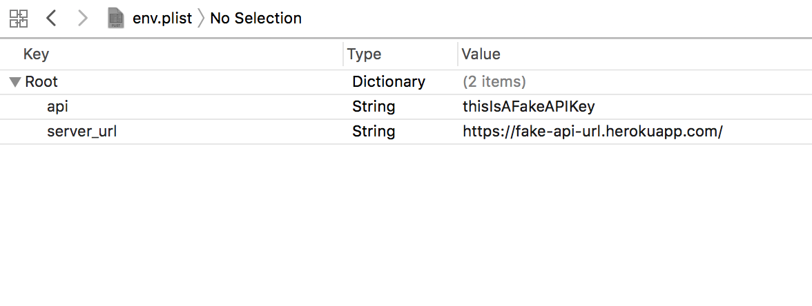

# DALI

[](https://travis-ci.org/dali-lab/DALI-Framework)
[](http://cocoapods.org/pods/DALI)
[](http://cocoapods.org/pods/DALI)
[](http://cocoapods.org/pods/DALI)

A framework used by DALI Lab members to access the internal API, which stores all information about DALI's projects, members, and events.

## Getting Started

### Authenticate
The API protects its data using two methods: private API key and Google OAuth2. This is done to support two different use cases: static installment or user-personal device.

#### Google OAuth2 (User-Personal)
A user-personal product could be an iOS app, Watch OS app, or anything that is personal to a user. This type of authentication uses the user's login credentials with Google to authenticate and identify them.

_Qualifications:_
- The application acts on behalf of a single member
- The application modifies member information
- The application needs access to protected member information

_Authenticating Using Google OAuth2:_
1. Choose a method of Google sign-in. Some good options are:
  - [GoogleSignIn](https://cocoapods.org/pods/GoogleSignIn)
2. When the user has signed in successfully with Google, extract their accessToken and refreshToken
  - Using [GoogleSignIn](https://cocoapods.org/pods/GoogleSignIn) the information is stored in `user.authentication`
3. Use those tokens to sign-in with the API
```swift
DALIapi.signin(accessToken: accessToken, refreshToken: refreshToken) { (success, error) in
    if success {
      // Continue into the app
      // Your api will handle authenticated requests from here on
    } else if let error = error {
      // There was an error
      // Most likely the user didn't use a @dali.dartmouth.edu email
    }
}
```

_Althernate Method: Google OAuth2:_

Some Google Signing sign-in systems (Not [GoogleSignIn](https://cocoapods.org/pods/GoogleSignIn)) may not sign the user in all the way, and instead of giving access and refresh tokens gives an authCode. In this case use `DALIapi.signin(authCode: authCode) { ... }`.

#### API Key Auth (Static-Installment)
A static-installment product could be an Apple TV app, a kiosk-type desktop application, or pretty much anything that doesn't need user sign-in. Its up to your imagination 😀!

_Qualifications:_
- The application does not act on behalf of any single member
- The application does not need to modify member information

_Authenticating Using API Key:_
1. Contact an API administrator to register for an API key to be made for your app.
  - The key's access will be limited to the routes you need, but you can request more routes later if you need them
  - Keep the key you get secret! It is an all access pass to the routes you were granted
2. Create a plist file (sample shown below) to store the key and add it to .gitignore

3. Load the file and load the config:
```swift
let file = NSDictionary(contentsOfFile: "path/to/your/file.plist")
let config = DALIConfig(dict: file)
```
4. Configure the API with your credentials
```swift
// ...
let config = DALIConfig(dict: file)
DALIapi.configure(config)
```

Done! Now you may make all the requests you are authorized to.

### Events

Now that you have authenticated your system you can move on to Events. Unfortunately for you, I haven't written this or any following parts of the Getting Started section yet, as it is Friday night and I am now heading out to play pong. If you have an urgent need, though, check out the [docs](https://dali-lab.github.io/DALI-Framework/). They are awesome and written by yours-truly.

## Installation

DALI is available through [CocoaPods](http://cocoapods.org). To install
it, simply add the following line to your Podfile:

```ruby
pod "DALI"
```

## Example
> Example project is still in alpha

To run the example project, clone the repo, and run `pod install` from the Example directory first.

## Author

John Kotz, john.kotz@dali.dartmouth.edu

## Requirements
##### Usage Requirements
You must be a member of the DALI Lab or be working on behalf (with the permission) of the DALI Lab to use this pod. By using this cocoapod you acknowledge this requirement.

##### Dependencies
- SwiftJSON

##### Function Specific Requirements
Some routes will intentionally crash your app if you use them without proper permission. Check out the docs on [Protected Functions]().

## License

DALI is available under the MIT license. See the LICENSE file for more info.
